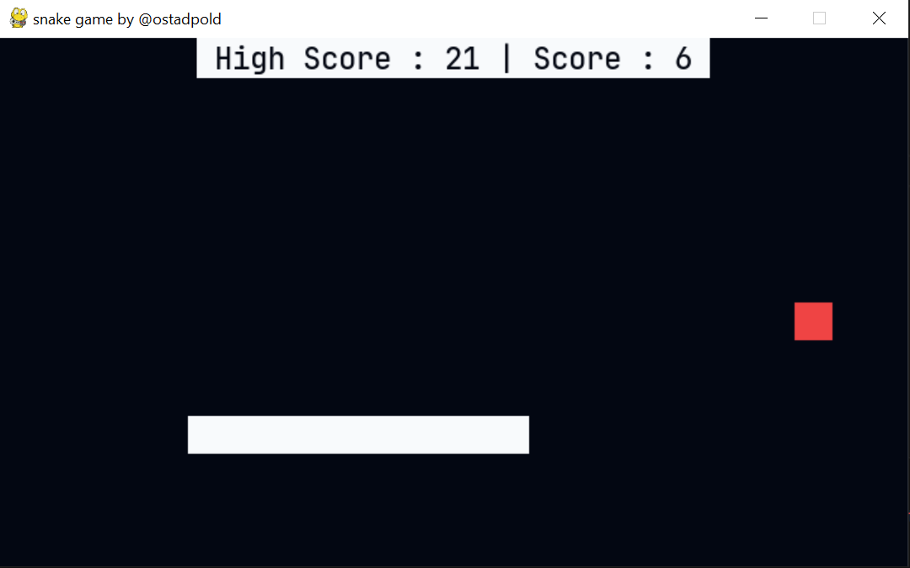

# pygame_snake_game

this is the snake game written on pygame python.

this is the result:

i get some lines of code from [this repository](https://github.com/rajatdiptabiswas/snake-pygame).

if you get error something like `increase/decrease the width by n and height by m` just make sure that the `w%step == 0` and `h%step == 0`.
